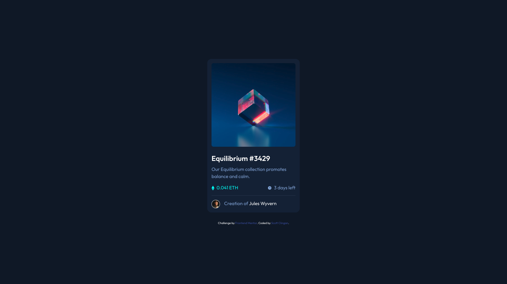

# Frontend Mentor - NFT preview card component solution

This is a solution to the [NFT preview card component challenge on Frontend Mentor](https://www.frontendmentor.io/challenges/nft-preview-card-component-SbdUL_w0U). Frontend Mentor challenges help you improve your coding skills by building realistic projects. 

## Table of contents

- [Overview](#overview)
  - [The challenge](#the-challenge)
  - [Screenshot](#screenshot)
  - [Links](#links)
- [My process](#my-process)
  - [Built with](#built-with)
  - [What I learned](#what-i-learned)
  - [Continued development](#continued-development)
  - [Useful resources](#useful-resources)
- [Author](#author)
- [Acknowledgments](#acknowledgments)

## Overview

### The challenge

Users should be able to:

- View the optimal layout depending on their device's screen size
- See hover states for interactive elements

### Screenshot

### Links

- Solution URL: (https://github.com/sclingan/NFT-Preview-Card)
- Live Site URL: (https://sclingan.github.io/NFT-Preview-Card)

## My process

### Built with

- Semantic HTML5 markup
- CSS custom properties
- Flexbox
- CSS Grid
- Mobile-first workflow
- [React](https://reactjs.org/) - JS library

### What I learned

Using React to learn more and push myself. I need to work more on SASS and use the cascade better. I learned more
about naming conventions and also using SVG's. Layering images for hover effects was a challenge, I need more practive.

### Continued development

I will continue working on accessibility and layering images on hover effects. Also need to work more
with SVG's.

### Useful resources

- (https://developer.mozilla.org/en-US/) - Great resource for all things web development.
- (https://www.w3schools.com) - A great resource for developers of any skill level.

## Author

- Frontend Mentor - [@sclingan](https://www.frontendmentor.io/profile/sclingan)

## Acknowledgments

Thanks to Frontend Mentor for a great challenge.

